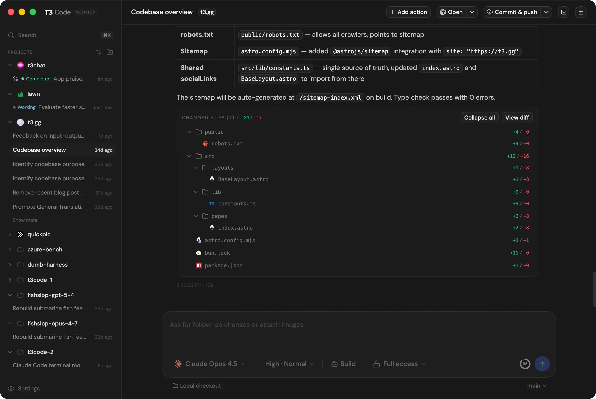

# Fluffy Parrot

A hardware-synthesiser–style control surface for the Anthropic Claude API. Every generation parameter is a physical rotary knob.



**[Download the latest DMG →](https://github.com/jayintheday/fluffy-parrot/releases/latest)**

> **Gatekeeper note:** The app is unsigned. On first launch macOS will block it. Right-click the app in Applications → Open → click Open in the dialog. You only need to do this once.

---

## Requirements

- macOS 13 Ventura or later
- Apple silicon
- An Anthropic API key (`sk-ant-...`)

---

## Features

- Rotary knobs for Temperature, Top-P, Top-K, and Max Tokens — drag vertically, hold Shift for fine control, or use the scroll wheel
- Three-position model knob: Haiku / Sonnet / Opus
- Live streaming responses with a 20-segment token meter
- System prompt editor (LCD-green on dark blue with scanlines)
- Prompt comparison lab — run two parameter configurations side by side and diff the outputs
- 4 themes: Default, Titanium, Cold Steel, Gunmetal
- API key stored encrypted in the macOS Keychain via `electron.safeStorage` — never held in app memory or passed to the renderer process

---

## Build from Source

Prerequisites: Node.js 20+ and npm, macOS.

```bash
git clone https://github.com/jayintheday/fluffy-parrot.git
cd fluffy-parrot
npm install
npm run dev       # development mode with hot reload
npm run build     # production build — produces a DMG in dist/
```

`npm run build` runs `electron-vite build && electron-builder` and outputs a DMG at `dist/mac-arm64/Fluffy Parrot-<version>.dmg`.

---

## Architecture

Three-tier Electron process model:

```
┌─────────────────────────────────┐
│  RENDERER  (src/)               │
│  React UI, hooks, state         │
│  window.electronAPI (typed)     │
└──────────────┬──────────────────┘
               │ contextBridge IPC
               ↓
┌─────────────────────────────────┐
│  PRELOAD  (electron/preload.ts) │
│  Exposes safe surface only      │
│  contextIsolation: true         │
└──────────────┬──────────────────┘
               │ ipcRenderer / ipcMain
               ↓
┌─────────────────────────────────┐
│  MAIN  (electron/main.ts)       │
│  Anthropic SDK, safeStorage     │
│  IPC handlers, window creation  │
└─────────────────────────────────┘
```

The renderer has no direct Node.js access. All Claude API calls and key storage go through IPC. `contextIsolation: true`, `nodeIntegration: false`.

See `CLAUDE.md` for a full architecture walkthrough, data flow diagram, and styling conventions.

---

## Contributing

See [CONTRIBUTING.md](CONTRIBUTING.md).

---

## License

Licensed under the [MIT License](LICENSE).
